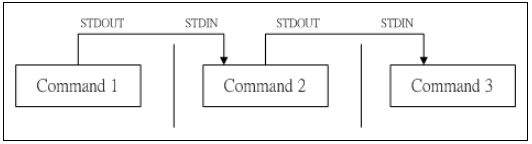
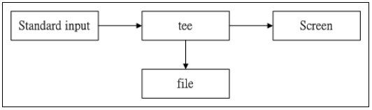

# 各種指令

#### 查看資料夾及檔案
`ls => 查看當前資料夾裡有哪些檔案(只會列出檔案名)`
`ll => 查看當前資料夾裡有哪些檔案(會列出檔案名、被修改日期、容量 ...)`

#### 查看操作說明
```
man [] => 查看操作說明 (ex. man date ...)

* man -f [] or whatis [] => 查看更多的操作說明
* man -k [] or apropos [] => 尋找關鍵字(只要文黨裡有這個字就會被找到)
* /[] or ?[] => 只能在man裡面使用，用來搜尋關鍵字
```
`info [] => 查看操作說明(較詳細)`

`Shift PageUP/PageDown => 頁面往上/下`

`[tab][tab](按兩下 tab) => 可查看未完成指令(命令/檔案補齊)`

`Ctrl c => 中斷目前程式`
`ctrl d => exit or 鍵盤輸入結束`
`w/who => 查看有哪些使用者正在使用`

`clear => 畫面清除`

`netstat -a => 查看網路狀態`

`ps -aux => 查看背景運行程式`

#### 關機方法
```
shutdown => 通知使用者關機時間，時間到時會關機 (只有root有權利使用)
* [數字] (輸入：now 代表立刻) => 幾分鐘後關機
* -t [數字] => 幾秒鐘後關機
* -k [數字] => 只是發送警告訊息，不會真的關機
* -r [數字] => 系統服務停掉後，重新開機
* -h [數字] => 系統服務停掉後，立即關機
```

`sync => 將在記憶體中的資料寫入硬體中`

#### 資料屬性
```
檔案資訊 =>

-rwxr-xr-x  24   root   root    4096   Jul 9 17:25 asdf.jpg
[  屬性  ][連結][擁有者][群組][檔案大小]   [修改日期] [檔案名稱]
```
```
檔案屬性 => [-/d] [rwx] [rwx] [rwx]
* [-] => 代表是檔案
* [d] => 代表是資料夾
* [l] => 代表連結檔(類似win中的捷徑)
* [b] => 代表裝置檔案裡可供儲存的設備
* [c] => 代表裝置檔裡的序列阜設備，如：鍵盤、滑鼠
* [s] => 代表資料接口檔(用於網路上的資料承接)
* [p] => 代表資料輸送檔(主要的目的是解決多個程序同時存取一個檔案所造成的錯誤)

* [rwx] => 第一組代表擁有人權限， 第二組代表同群組權限， 第三組代表其他非本群組權限
* [r] => 可讀
* [w] => 可寫
* \[x] => 可執行  
**注意**
```
```
drwx---r--
這樣的話其他群組的人員並無法進入該資料夾，因為x與目錄的關係相當的重要，
如果你在該目錄底下不能執行任何指令的話，那至然也無法進入了，
因此也特別留意，如果你要讓其他人進來此目錄的話，要開放x喔!!

在Linux中，檔案能否執行的關鍵在於x是否開放，跟副檔名無關!!

* [-] => 無此屬性
```

#### 更改檔案權限
`chgrp => 更改檔案所屬群組 (change group縮寫)`
`chown => 更改檔案所屬人 (change owner縮寫)`
`chmod => 更改檔案屬性、SUID、等等的特性 `

**chmod**
```
更改 -rwxrwxr-- 
方法一：

r => 4
w => 2
x => 1

owner => rwx => 4+2+1 = 7
group => rwx => 4+2+1 = 7
other => r-- => 4+0+0 = 4

chmod 777 [檔案]
=> -rwxrwxrwx
```


更改 -rwxrwxr--
方法二：

| chmod | u(user)<br>g(group)<br>o(other)<br>a(all) | +(加入)<br>-(去除)<br>=(設定) | r<br>w<br>x | 檔案或目錄 |
|--|--|--|--|--|
```
example
chmod u=rwx,go=rx [檔案]

chmod a+w [檔案]
```
#### 建立資料夾
`mkdir [資料夾名稱]`

#### 建立空的檔案
```
touch

touch [檔案名] => 在當前資料夾產生檔案

touch [指定現有資料夾]/[檔案名] => 在指定的資料夾內產生檔案
```
`cat [檔案名] => 讀取檔案內容並且顯示出來(讀取資料格式檔時會出現亂碼)`


#### 變換目錄
```
cd(Change Directory)

cd [資料夾名稱(相對路徑or絕對路徑)]
cd [~username] => 回到家目錄
cd ~ => 回到家目錄
cd .. => 回到上一層
cd - => 回到剛剛的目錄
```
#### 顯示路徑
```
pwd(Print Working Directory)

pwd -P => 顯示確實路經，不是使用連結之路徑
pwd => 顯示路徑(可能是連結路徑)
```

#### 建立新目錄(資料夾) 
```
mkdir [目錄名稱] => 建立一個目錄
mkdir -p test1/test2/test3/test4 => 建立多層目錄
mkdir -m [權限設定][目錄名稱] => 建立目錄，設定權限 (ex. mkdir -m 711 test2)
```      

#### 刪除"空"目錄
```
rmdir -p [目錄名稱] => 連同上層空的目錄一起刪除
rmdir [目錄名稱] => 刪除空目錄
```

#### 複製、移動、刪除
`cp[來源檔][目的檔]`
```
rm [檔案名稱] => 移除檔案
**如果資料夾裡面有檔案，會無法刪除**
**如果真的確定資料夾裡的檔案都不需要，可以用 rm -rf，這樣就能把整個資料夾移除**
-f => 強制移除
-r => 遞迴刪除 (常用在資料夾)
-i => 互動模式 (再刪除前會做詢問的動作)
```
```
mv [檔案名稱(可多個)][要移動到的資料夾]
如果要移動的資料夾不是在當前目錄，就要把路徑打出來
```

#### 檢視檔案內容
`cat => 由第一行開始顯示`
`tac => 從最後一行開始顯示`
`nl => 顯示時順便顯示行號`
`more => 一頁一頁的顯示`
`less => 跟more一樣，但是可以往前翻頁`
`head => 只看前幾行`
`tail => 只看最後幾行`
`od => 以二進位方式讀取`

#### 修改檔案時間及建立新檔
```
touch

modification time (mtime) => 檔案內容的修改日期
status time (ction) => 檔案狀態的修改日期 (ex. 權限及屬性修改)
access time (atime) => 檔案被取用或讀取時的時間 (ex. 使用cat讀取檔案時)

使用-d時，會改變 mtime & atime 
```

#### 檔案權限預設
`umask => 該預設值需要減掉的權限`

#### 設定及顯示檔案隱藏屬性
`chattr => 設定檔案隱藏屬性`
`lsattr => 顯示檔案隱藏屬性`

#### 執行 .sh檔
`bash => 執行 .sh檔`

#### 變數設定
`[變數]=[值]`
`echo $[變數] => 看變數裡的值`
`$[變數] => 執行`

**單、雙引號的差別**

`雙引號 => 為原字串添加新字串，裡面的特殊字元仍可以保有變數特性`
`單引號 => 直接附值`

#### 使用者輸入
```
read [-pt] 變數名
-p => (後面接)提示字元
-t => 等待秒數
```
#### 命令別名設定
`alias => 查看目前有哪些命令別名`
`alias [別名]='命令' => 可使用別名來執行命令`
`unalias [別名] => 移除該命令別名`

#### 找尋檔案
`locate [名稱] => 會找檔案名稱裡有這些字的檔案`

#### 一行執行多個指令( ; )
`利用';'來隔開 => ex. sync; sync; shutdown -h now(關機前執行兩次sync)`

#### 管線命令( | )

`[命令.1]|[命令.2] => 命令.1 執行完後把結果給命令.2 執行`

#### 雙向重導向(tee)

`[命令.1]|tee [-a] file|[命令.2] => 將命令.1 的結果存到 file中 並且也將該結果給命令.2`


