#### 創建新的Module(model)
`Terminal -> odoo-bin scaffold <module name> <where to put it>`

***

#### menuitem創建(view)

<menuitem name="mySevers" id="my_severs.menu_root"/>

        <!-- menu categories -->

***parent => 在哪一個目錄下，用那個目錄的id***

        <menuitem name="Severs" id="my_severs.menu_1" parent="my_severs.menu_root"/>

        <!--<menuitem name="Menu 2" id="my_severs.menu_2" parent="my_severs.menu_root"/>-->

***action 可自己取名，但是不能使用 "."***

        <!-- actions -->

        <menuitem name="EntitySever" id="my_severs.menu_1_list" parent="my_severs.menu_1"
                  action="Entity_severs_action"/>

        <menuitem name="VirtualSever" id="my_severs.menu_2_list" parent="my_severs.menu_1"
                  action="Virtual_severs_action"/>

***用res_model來區分，要顯示的目標***
     
        <!-- 子標題的視窗顯示 -->
        
         <record model="ir.actions.act_window" id="Entity_severs_action">
            <field name="name">EntitySevers</field>
            <field name="res_model">my_severs.my_severs</field>
            <field name="view_mode">tree,form</field>
       </record>

        <record model="ir.actions.act_window" id="Virtual_severs_action">
            <field name="name">VirtualSevers</field>
            <field name="res_model">my_severs.virtual_sever</field>
            <field name="view_mode">tree,form</field>
        </record>

***

#### formView(view)

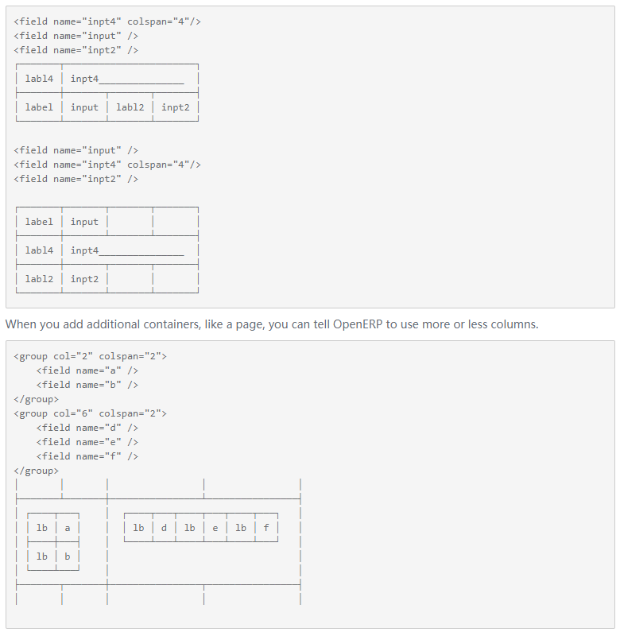
```
 <record id="my_severs_record_form" model="ir.ui.view">
            <field name="name">mySevers_form</field>
            <field name="model">my_severs.my_severs</field>
             要以哪一個class為目標, 名稱要用class 裡的 _name='名稱' 名稱

            <field name="arch" type="xml">
                <form string="Severs"> string => 為顯示的名稱
                    <header>
                    </header>
                    <sheet>
                        <group col="2"> => group(群組), 
                                           col='數字' -> 分成幾個欄位(橫向的),若無col,則底下的group會垂直分群
                                           colspan='數字' -> 一個欄位要占多少個欄位空間
                            <group>
                                <field name="IP_Address"/>
                                <field name="HostName"/>
                                <field name="HostCategory"/>
                                <field name="PropertyNumber"/>
                                <field name="CabinetNumber"/>
                                <field name="Description"/>
                            </group>
                            <group>
                                <field name="YearOfPurchase"/>
                                <field name="Brand" options='{"no_open": True, "no_create": False}'/>
                                該欄位為下拉式選單

                                <field name="Warranty"/>
                                <field name="MaintainCompany" options='{"no_open": True, "no_create": False}'/>
                            </group>
                            <notebook>
                                <page>
                                    <field/>
                            <!--form表下方的書籤單，可用於分類輸入資訊的分類-->
                                </page>
                            </notebook>
                        </group>
                    </sheet>
                </form>
            </field>
        </record>
```

***nameget 標題旁的副標題設定***

```
@api.multi
def name_get(self):  =>繼承至model
    result = []  =>一定要有
    for record in self:
        name = record.CD_Title
        result.append((record.id, name))  =>一定要有
    return result
```

***

#### searchView(view)

```
<record id="my_severs_record_search" model="ir.ui.view">
            <field name="name">mySevers_search</field>
            <field name="model">my_severs.my_severs</field>
            <field name="arch" type="xml">
                <search>
                    <field name="HostName" string="HostName"/>
                    <!--field 搜尋該欄位是否有這個值-->

                    <filter name="Brand" string="Brand"/>
                    <!--filter-->

                    <filter name="CabinetNumber" string="CabinetNumber"/>
                    <filter name="HostCategory" string="HostCategory"/>
                    <filter name="MaintainCompany" string="MaintainCompany"/>
                    <group name="Group By">
                    <!--以該欄位來分組-->
                        <!--name => DataBase欄位名稱,class 相對應的變數名-->
                        <!--string => 畫面顯示名稱-->
                        <filter name="brand" string="品牌" context="{'group_by': 'brand'}"/>
                        <filter name="cabinet_number" string="機櫃編號" context="{'group_by': 'cabinet_number'}"/>
                        <filter name="host_category" string="機器種類" context="{'group_by': 'host_category'}"/>
                        <filter name="maintain_company" string="維護廠商" context="{'group_by': 'maintain_company'}"/>
                    </group>
                </search>
            </field>
        </record>
```

***

#### inherit(model)

**!! 繼承class時，要在__manifest__裡的depends添加要繼承的modle的資料夾名稱 !!**

***
#### inherit(view)

**!! 繼承畫面必須要再建立一個.py跟.xml檔 !!**
(.py可以取名為 res_partner .xml 可以取名為 res_partner_views)
**!! 要在model資料夾裡的 __init__.py 裡面import 該.py檔 !!**
**!! 要在__manifest__.py裡面 data 添加新增的.xml (ex. views/res_partner_views) !!**
**繼承其他model(資料夾)時，繼承的id前面要加上該資料夾名**
**繼承的id要記得改**
`<field name="inherit_id" ref="資料夾名.要繼承畫面的id"/>`

**要在繼承畫面裡新增東西，可以是任何TAG(不一定是field)，position的值可以當成是在xml裡的哪邊**
`<sheet position='before'>` `<group position='inside'>`
**要更改attribute時，要小心position有多一個"s"， position="attributes"，\<attribute>**
```
<field name="date_deadline" position="attributes">
    <attribute name="invisible">context.get('deadline_visible',False)</attribute>
</field>
```

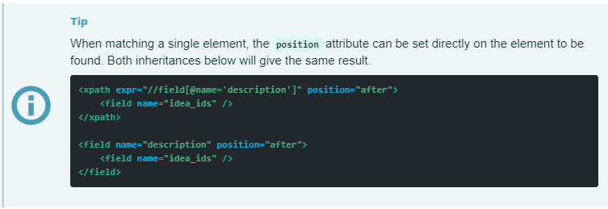
```
<!-- improved idea categories list -->
<record id="idea_category_list2" model="ir.ui.view">
    <field name="name">id.category.list2</field>
    <field name="model">idea.category</field>
    <field name="inherit_id" ref="id_category_list"/>
    <!--選擇要繼承的目標-->

    <field name="arch" type="xml">
        <!-- find field description and add the field
             idea_ids after it -->

        <xpath expr="//field[@name='description']" position="after">
          <field name="idea_ids" string="Number of ideas"/>
        </xpath>

        <!--上面的另一種寫法-->

        <field name="description" position="after">
        <!--position => 新增欄位在指定的欄位前面或後面-->
            <field name="idea_ids/>
            <!--這是新增的欄位-->
        </field>

    </field>

    <record model="ir.ui.view" id="partner_instructor_form_view">
            <field name="name">partner.instructor</field>
            <field name="model">res.partner</field>

            <field name="inherit_id" ref="base.view_partner_form"/>
            <!--繼承的目標是要繼承的畫面的id "base.view_partner_form"-->

            <field name="arch" type="xml">
                <notebook position="inside">
                <!--在指定繼承的目標畫面裡面新增notebook-->

                    <page string="Sessions">
                        <group>
                            <field name="instructor"/>
                            <field name="session_ids"/>
                        </group>
                    </page>
                </notebook>
            </field>
        </record>
</record>
```
(inherit view)
**自己的book_store裡，用cd_list繼承book_list並在form表裡面新增一個test_field欄位在description後面**

***要注意 "model" & "inherit_id" 不要輸入錯了 !!!***

程式碼如下：

.xml
```
<odoo>
    <data>
        <record model="ir.ui.view" id="book_store_form_test">
            <field name="name">book_store_test</field>
            <field name="model">book_store.book_store</field>
            <field name="inherit_id" ref="book_store_form"/>
            <field name="arch" type="xml">
                <field name="description" position="after">
                    <field name="test_field"/>
                </field>
            </field>
        </record>
    </data>
</odoo>
```

.py
```
from odoo import models, fields, api


class ResPartner(models.Model):
    _inherit = 'book_store.book_store'

    test_field = fields.Char()

```

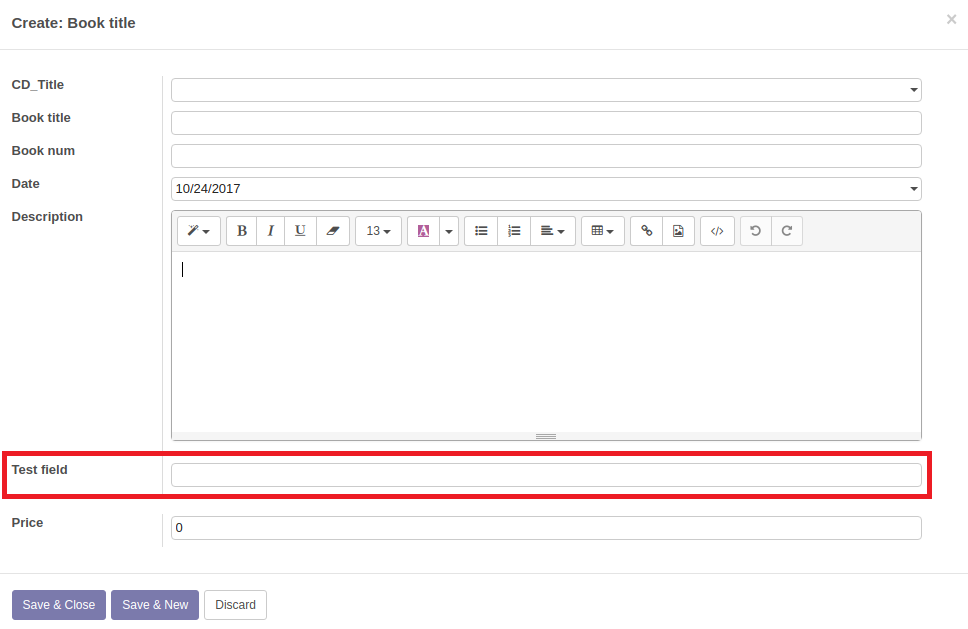

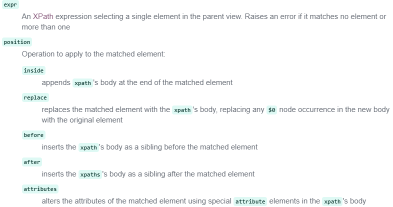

***

#### model(model)
`name = fields.xxx(Attributes)`
***Attributes***
`required = True/False => 該欄位是否為必填`
`string = 'xxx' => 該欄位顯示的名稱為 xxx, 且該欄位在DataBase裡面的 Field Lebel顯示名稱`
`help = 'xxx' => 提示為 xxx`
`compute = 'function 名稱' => 對該欄位用此function進行處理`
`password = "True" => 該欄位顯示輸入的資料是 ... (就像輸入密碼時的顯示一樣)`

***fields.Selection***
`host_category = fields.Selection([('DataBase欄位名稱', '畫面顯示名稱'),('physical', '實體機'), ('virtual', '虛擬機')], '主機種類')`

***

#### constraints(限制)(model)
```
 @api.constrains('IP_Address')
<!--對欄位'IP_Address'進行限制-->
<!--可傳多個欄位-->

    <!--限制的條件-->
    def ip_address_check(self):
        check_list = ['1', '2', '3', '4', '5', '6', '7', '8', '9', '0', '.']
        x = 0
        if self.IP_Address:  # IP_Address沒有值,會傳False進來
            if len(self.IP_Address) > 15:
                raise ValidationError('Error! IP_Address is WRONG!!!!.')
            else:
                for each_char in self.IP_Address:
                    if each_char == '.':
                        x += 1
                if each_char not in check_list:
                    raise ValidationError('Error! IP_Address is WRONG!!!!.')
            if x != 3:
                raise ValidationError('Error! IP_Address is WRONG!!!!.')
        else:
            pass

        if self.IP_Address:
            ip_context = self.IP_Address.split('.')
            for y in ip_context:
                if len(y) > 3:
                    raise ValidationError('Error! IP_Address is WRONG!!!!.')
```

***

**sql_constrains**
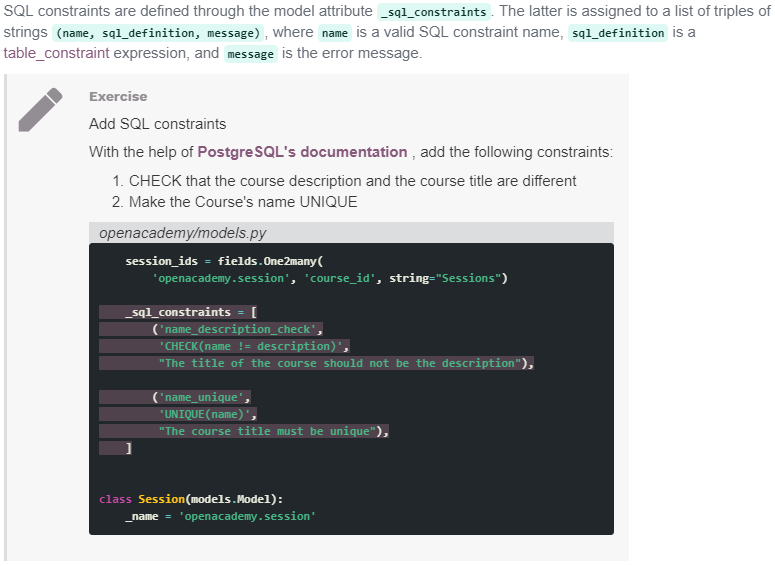

[PostgreSQL Check](https://www.postgresql.org/docs/9.3/static/ddl-constraints.html)

***

#### treeview

***decoration-xxx***
用字體顏色來表達狀態
當某欄位等於所設定的狀況時會是所設定的顏色
`<tree decoration-success="host_category == 'physical'" decoration-danger="host_category == 'virtual'">`

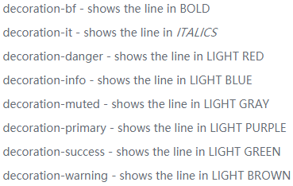

***在最後面做值的加總***
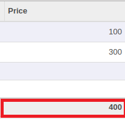
**在 .xml裡面，在想加總的該欄位加上 sum (sum 後面的名稱可以亂取)**

程式碼如下：
`<field name="Price" sum="price"/>`

除了sum還有 avg、min、max可填

**設定Defult GruopBy**

```
在action裡面加上
<field name="context">{'group_by': 'xxx'}</field>
```
[網址在這裡](https://www.odoo.com/forum/help-1/question/how-to-add-a-default-group-by-filter-to-tree-view-29874)

**editable**

`<tree string="book_store_tree" editable="bottom">`

editable ="bottom/top"
bottom/top => 按create時，新增在下面或在上面
有設定時可以直接在treeview的畫面上做資料的修改、新增及刪除，所以就**不會進入formview**
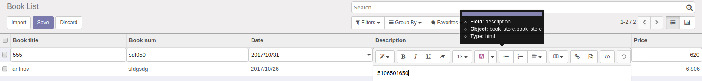

***

#### many2one、one2many(model)

當欄位使用many2one or one2many 時，可以選取對象以創建好的項目外，也可以對該對象新增項目，只要在自己的 .xml裡面增加 option即可

程式碼如下：

(brand去 'res.partner' 取資料)
`brand = fields.Many2one('res.partner', '品牌')`

`<field name="brand" options='{"no_open": True, "no_create": False}'/>`

```
no_open： True => 不能更改選取項目的資料
          False => 可以更改選取項目的資料   (選取完想要的項目後，該欄位後方會多出一個icon，點擊後即可編輯)

no_create： True => 不能創建新的項目
            False => 能新增新的項目
```
***

#### 動態改變required(attrs)(view)(model)

*invisible、required、readonly 可用*

**想做的效果是當我 主機種類 選到 "虛擬機" 時， VM種類要是必填的欄位，但是在其他選項中則不是必填。**

**在xml裡，form裡的欄位加上 attrs，缺點是當判斷不是只有幾個固定值時，代碼不易寫**

代碼範例如下：
`<field name="field_name" attrs="{'required':[('other_field','=','other_value')]}"/>`

這次的解決代碼如下：
`<field name="vm_type" options='{"no_open": False, "no_create": False}' attrs="{'required':[('host_category','=','virtual')]}"/>`

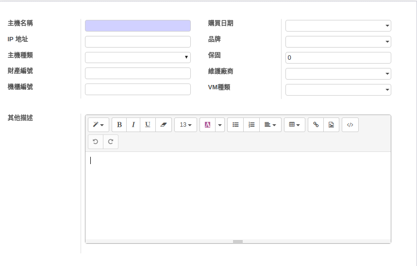
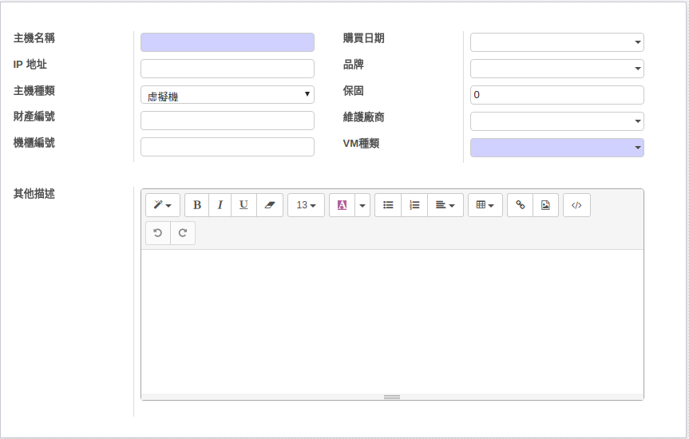
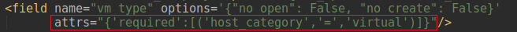

***其他資料 在Packt.Odoo.10.Development.Essentials.1785884883.pdf
的 p165 有介紹Dynamic attributes(attrs)***

#### _order(model)

**用於排序，就像是SQL裡面的ORDER BY**
`_order = 'price'`